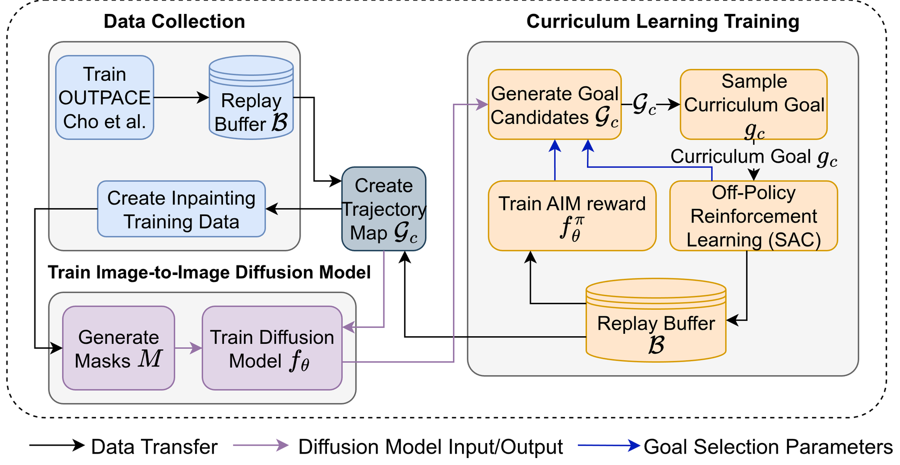
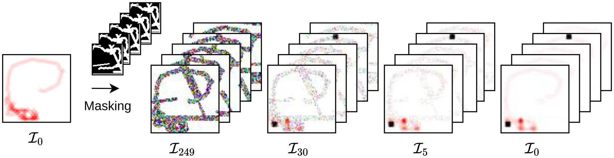
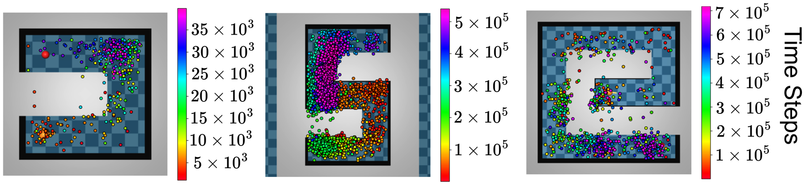

<div align="center">

# Palette Inpainting Diffusion Curriculum Reinforcement Learning (PIDCRL)

<p align="center">
  <strong>Official PyTorch Implementation</strong>
</p>

<p align="center">
  <strong>2026 IEEE World Congress on Computational Intelligence (WCCI 2026)</strong><br>
  <em>WCCI 2026 Proceedings / IJCNN 2026</em>
</p>

<p align="center">
  <a href="https://farukoruc.github.io/">Faruk Oruç</a><sup>1</sup> &nbsp;•&nbsp;
  <a href="https://erdisayar.github.io/">Erdi Sayar</a><sup>2</sup> &nbsp;•&nbsp;
  <a href="https://www.unitn.it/en/giovanni.iacca">Giovanni Iacca</a><sup>3</sup> &nbsp;•&nbsp;
  <a href="https://www.ce.cit.tum.de/air/people/prof-dr-ing-habil-alois-knoll/">Alois Knoll</a><sup>1</sup> &nbsp;•&nbsp;
  <a href="https://erdalkayacan.github.io/">Erdal Kayacan</a><sup>2</sup>
</p>

<p align="center">
  <sup>1</sup>Technical University of Munich (TUM) &nbsp;|&nbsp;
  <sup>2</sup>Paderborn University &nbsp;|&nbsp;
  <sup>3</sup>University of Trento
</p>

<p align="center">
  <a href="https://linklings.s3.amazonaws.com/organizations/WCCI/wcci2026/submissions/stype114/rzBWR-ijcnn_pap1015s2.pdf"></a>
  <a href="https://drive.google.com/file/d/1-NZP3ivtMJnOrA00uEOr3jzbrScEcP1W/view"></a>
  <a href="LICENSE"></a>
</p>

---

</div>

## 📌 Overview

**PIDCRL** (*Palette Inpainting Diffusion Curriculum Reinforcement Learning*) is a generative curriculum reinforcement learning framework that formulates curriculum goal generation as an **image inpainting task**. 

Curriculum reinforcement learning (CRL) accelerates agent learning by ordering tasks in a progressively challenging sequence. However, existing methods often struggle to steer agents toward meaningful exploration frontiers without manual heuristics or domain-specific distance metrics. 

PIDCRL addresses this by repurposing a conditional image-to-image diffusion model (**Palette**) conditioned on **trajectory heatmaps**. By learning from trajectory-goal pairs, the diffusion model implicitly captures environmental geometry and navigability constraints, generating reachable yet suitably challenging curriculum goals.

<div align="center">
  
  <p><em>Figure 1: Overview of the PIDCRL framework across its three phases: (I) Data Collection via OUTPACE, (II) Palette Image-to-Image Diffusion Model Training with path-oriented masking, and (III) Curriculum Learning Training with generative goal sampling and strategic filtering.</em></p>
</div>

---

## 🚀 Key Highlights

- **Visual Generative Curriculum:** Replaces heuristic or hand-engineered goal generation with an image-to-image diffusion model ([Palette](https://arxiv.org/abs/2111.05826)) trained on trajectory heatmaps.
- **Path-Oriented Masking:** Employs a specialized masking mechanism that occludes visited trajectories and goal regions, training the diffusion model to predict natural exploration targets.
- **Strategic Goal Filtering:** Implements multiple candidate selection mechanisms:
  - **AIM-based:** Ranks candidates using a learned classifier/proximity reward function $f_\theta^\pi$.
  - **Q-Value Scoring:** Prioritizes goals offering maximal expected value / learning progress.
  - **Centroid / Averaging:** A computationally lightweight baseline averaging generated candidates.
- **State-of-the-Art Performance:** Matches or outperforms **10 competitive CRL baselines** (*OUTPACE, HGG, GoalGAN, GRADIENT, CURROT, ACL, ALP-GMM, VDS, SPRL, PLR*) across complex continuous-control navigation and manipulation benchmarks.

---

## 🎨 Generative Goal Inpainting in Action

### 1. Reverse Diffusion on Trajectory Heatmaps
Given a masked trajectory heatmap, the reverse diffusion process progressively removes Gaussian noise conditioned on the unmasked context to propose reachable curriculum goals:

<div align="center">
  
  <p><em>Figure 2: Trajectory heatmap $\mathcal{I}_0$ is masked and iteratively denoised across diffusion timesteps ($\mathcal{I}_{249} \to \mathcal{I}_{30} \to \mathcal{I}_5 \to \mathcal{I}_0$) to synthesize prospective goal candidates.</em></p>
</div>

### 2. Curriculum Progression Over Time
As training progresses, the generated curriculum goals expand outward along solvable paths, progressively guiding the agent through challenging maze topologies:

<div align="center">
  
  <p><em>Figure 3: Curriculum goals generated by PIDCRL across training timesteps for PointUMaze, PointNMaze, and PointSpiralMaze. The color spectrum illustrates how goals transition smoothly from initial states to the distant target.</em></p>
</div>

---

## 📂 Repository Structure

```plaintext
DiffusionOutpace/
├── assets/                 # High-resolution architectural figures & diagrams
├── config/                 # Hydra configurations for environments and training
│   ├── config_outpace.yaml # Main training and goal selection configuration
│   └── paths/              # Local machine path templates
├── envs/                   # Environment definitions (MuJoCo mazes & MetaWorld tasks)
├── hgg/                    # Hindsight Goal Generation baseline utilities
├── meta-nml/               # Non-parametric metric learning module
├── mujoco_maze/            # MuJoCo maze environment suite
├── palette/                # Palette image-to-image diffusion model implementation
│   ├── config/             # Diffusion training configurations
│   ├── data/               # Heatmap dataset loaders and mask generators
│   └── run.py              # Script to train/test the diffusion model
├── results/                # Quantitative logs and evaluation CSVs across benchmarks
├── outpace_train.py        # Main PIDCRL / OUTPACE training entrypoint
├── outpacesac.py           # Soft Actor-Critic (SAC) implementation with curriculum goals
├── outpace_core.py         # Curriculum generator and selector dispatch logic
├── goal_sampler_demo.py    # Standalone demo for sampling goal heatmaps
└── install.sh              # Dependency installer for submodules
```

---

## 🛠️ Setup & Installation

### 1. Conda Environment
Create and activate the environment:
```bash
conda env create -f outpace.yml
conda activate outpace
pip install -r outpace_requirements.txt
```

### 2. Submodule Dependencies
Set up the `meta-nml` package and compile necessary C/submodule extensions:
```bash
# Add meta-nml path
conda develop meta-nml

# Install meta-nml requirements and compile extensions
cd meta-nml && pip install -r requirements.txt
cd ..

chmod +x install.sh
./install.sh
```

### 3. Install PyTorch
Install a PyTorch build suitable for your CUDA setup (refer to [PyTorch Getting Started](https://pytorch.org/get-started/locally/)):
```bash
# Example for CUDA 11.8:
pip install torch torchvision --index-url https://download.pytorch.org/whl/cu118
```

### 4. Configure Local Paths
Copy the template path configuration and set your local project directories:
```bash
cp config/paths/template.yaml config/paths/config_path.yaml
```
Open `config/paths/config_path.yaml` and set:
- `default_save_path_prefix`: Base directory where experiment checkpoints/logs will be written.
- `default_env_path`: Path to `envs/AntEnv/envs/antenv`.
- `default_hgg_gcc_path`: Path to `hgg`.

### 5. (Optional) Robotic Arm Environments (MetaWorld)
If running Sawyer manipulation environments:
```bash
git clone https://github.com/Farama-Foundation/Metaworld.git
cd Metaworld
git reset --hard 84bda2c
pip install -e .
cd ..
```

### 6. Pretrained Diffusion Weights
Download the pre-trained Palette checkpoint weights:
- **Download Link:** [Google Drive - Pretrained Weights](https://drive.google.com/file/d/1-NZP3ivtMJnOrA00uEOr3jzbrScEcP1W/view)

Extract the archive into a root folder named `weights/` structured as follows:
```plaintext
weights/
├── PointUMaze/300_Network.pth
├── PointNMaze/300_Network.pth
├── PointSpiralMaze/300_Network.pth
├── sawyer_peg_push/300_Network.pth
├── sawyer_peg_pick_and_place_xy/300_Network.pth
└── sawyer_peg_pick_and_place_yz/300_Network.pth
```

---

## 🚦 Training & Usage

The PIDCRL framework operates in three sequential phases:

### Phase 1: Data Collection
Train a baseline exploration agent (OUTPACE) to populate trajectory heatmaps and goal pairs. Configure flags in `config/config_outpace.yaml`:
- Set `diffusion_curriculum: false` to collect demonstration trajectories into replay buffers.

### Phase 2: Train the Diffusion Model
Train the Palette diffusion model on the generated trajectory heatmap dataset using path-oriented masks:
```bash
cd palette
python run.py -p train -c config/inpainting_u_maze_64.json
cd ..
```
*(Refer to [`palette/README.md`](palette/README.md) for custom hyperparameter settings and mask configurations).*

### Phase 3: PIDCRL Curriculum RL Training
Train the goal-conditioned SAC agent guided by the diffusion inpainting curriculum generator:

#### Navigation Mazes
- **Point-U Maze (`PointUMaze-v0`):**
  ```bash
  CUDA_VISIBLE_DEVICES=0 python outpace_train.py env=PointUMaze-v0 aim_disc_replay_buffer_capacity=10000 adam_eps=0.01
  ```
- **Point-N Maze (`PointNMaze-v0`):**
  ```bash
  CUDA_VISIBLE_DEVICES=0 python outpace_train.py env=PointNMaze-v0 aim_disc_replay_buffer_capacity=10000 adam_eps=0.01
  ```
- **Point-Spiral Maze (`PointSpiralMaze-v0`):**
  ```bash
  CUDA_VISIBLE_DEVICES=0 python outpace_train.py env=PointSpiralMaze-v0 aim_disc_replay_buffer_capacity=20000 aim_discriminator_cfg.lambda_coef=50
  ```

#### Sawyer Robotic Manipulation Tasks
- **Sawyer Peg Pick & Place:**
  ```bash
  CUDA_VISIBLE_DEVICES=0 python outpace_train.py env=sawyer_peg_pick_and_place aim_disc_replay_buffer_capacity=30000 normalize_nml_obs=true normalize_f_obs=false normalize_rl_obs=false adam_eps=0.01
  ```
- **Sawyer Peg Push:**
  ```bash
  CUDA_VISIBLE_DEVICES=0 python outpace_train.py env=sawyer_peg_push aim_disc_replay_buffer_capacity=30000 normalize_nml_obs=true normalize_f_obs=false normalize_rl_obs=false adam_eps=0.01 hgg_kwargs.match_sampler_kwargs.hgg_L=0.5
  ```

---

## 📊 Benchmark Results

PIDCRL significantly improves sample efficiency and asymptotic performance compared to existing CRL techniques:

| Method | PointUMaze (steps to 1.0 success) | PointNMaze (steps to 1.0 success) | PointSpiralMaze (steps to 1.0 success) |
| :--- | :---: | :---: | :---: |
| **PIDCRL (Ours)** | **25,400 ± 1,020** | **87,625 ± 21,702** | **234,125 ± 23,089** |
| OUTPACE | 29,800 ± 4,166 | 113,333 ± 24,267 | 396,875 ± 111,451 |
| HGG | 48,750 ± 24,314 | — *(failed to converge)* | — *(failed to converge)* |
| GRADIENT | 263,431 ± 114,795 | — *(failed to converge)* | — *(failed to converge)* |

> Raw CSV logs and evaluation statistics for all seeds are available in [`results/`](results/).

---

## 📑 Citation

If you find this work, repository, or pre-trained models useful in your research, please cite our paper:

```bibtex
@inproceedings{oruc2026pidcrl,
  title={Palette Inpainting Diffusion Curriculum Reinforcement Learning (PIDCRL)},
  author={Oru{\c{c}}, Faruk and Sayar, Erdi and Iacca, Giovanni and Knoll, Alois and Kayacan, Erdal},
  booktitle={2026 IEEE World Congress on Computational Intelligence (WCCI 2026) / International Joint Conference on Neural Networks (IJCNN)},
  year={2026},
  organization={IEEE},
  url={https://linklings.s3.amazonaws.com/organizations/WCCI/wcci2026/submissions/stype114/rzBWR-ijcnn_pap1015s2.pdf}
}
```

---

## 🙏 Acknowledgements

This repository builds upon and integrates code from the following projects:
- [OUTPACE](https://github.com/jayLEE0301/outpace_official): Generating Diversified Curricula through Out-of-Distribution Exploration.
- [Palette](https://github.com/Janspiry/Palette-Image-to-Image-Diffusion-Models): Image-to-Image Diffusion Models (Saharia et al., SIGGRAPH 2022).
- [mujoco-maze](https://github.com/kngwyu/mujoco-maze): Continuous-control maze navigation environments.
- [Metaworld](https://github.com/Farama-Foundation/Metaworld): Open-source benchmark for meta-reinforcement learning and multi-task robotic manipulation.

---

## 📄 License

This project is licensed under the MIT License — see the [LICENSE](LICENSE) file for details.